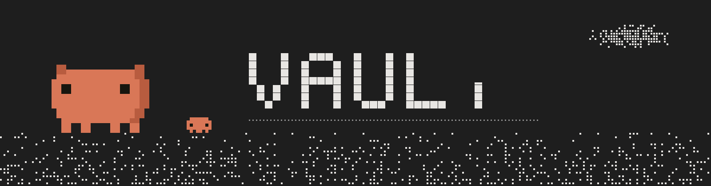
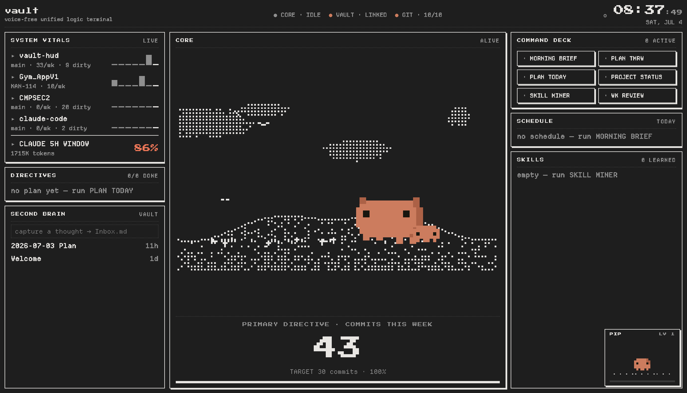

<p align="center">
  
</p>

<p align="center">
  <em>a halftone pixel HUD for your local workstation — your repos, your markdown workspace,<br/>your AI usage window, and a small pixel companion who lives in all of it</em>
</p>

<p align="center">
  
  
  
</p>

<p align="center">
  
</p>

---

# vault

## What it does

- **System vitals** — commits this week, branch, and dirty files for every
  repo you track, with pixel sparklines; plus your rolling **token window**
  parsed from your CLI agent's local session transcripts (or live CPU load
  when you run a local model). An `[VOL]` ambient row hosts the built-in
  lo-fi synth: mainframe fan hum, tape hiss, and a square-wave tick every
  time you check off a directive.
- **Multi-provider matrix** — `[ ANTHROPIC ] [ OPENAI ] [ OLLAMA ]` toggle
  in the notch island. It routes command execution to the matching CLI
  (`claude` / `codex` / `ollama run`) and re-aims the usage meter: cloud
  providers meter tokens, local ollama meters CPU.
- **Command deck** — one-click buttons that run your agent headlessly:
  Morning Brief, Plan Today, Plan Tmrw, Project Status, Wk Review, Skill
  Miner. Every command is a plain markdown prompt in `commands/` — edit them
  freely. Output lands in your workspace as notes; the HUD is a lens.
- **Second Brain** — quick-capture box straight into `Inbox.md`, the freshest
  notes from anywhere in your workspace, and one resurfaced note a day from
  the archive. **Hover any note and the Core dissolves into a constellation
  graph** of your wiki-links — click a star to open that note in your OS
  default editor.
- **Zero-config markdown engine** — point `vaultPath` at ANY folder of `.md`
  files. Optional YAML frontmatter (`status`, `due`) is parsed when present;
  otherwise plain GFM checkboxes (`- [ ]`) are picked up from body text.
  Deadlines are read naturally: date-named files (`2026-07-04.md`), inline
  tags (`#today`, `2026-07-09`), or the file's own timestamp. A native fs
  watcher keeps everything live. No app lock-in, no required format.
- **Totem + Sprite Studio** — drop any image into settings and it's crunched
  into a flat 8-bit sprite in its own palette, backdrop stripped; display it
  big in the Totem panel or send it patrolling the HUD frame.
- **Directives** — today's tasks from wherever they live; checking one writes
  `- [x]` back into the markdown (with a satisfying tick pop).
- **Core** — a pixel companion (a chunky clay blob) living through eight
  scenes (meadow, surf, garden, disco, globe, night, rain, rooftop) with
  friends: buddies, birds, snails, fireflies. Between scenes it plays a
  **loading interstitial** — the world dissolves out to the blob "working"
  with cycling dots, then dissolves into the next scene. While a command
  runs it locks to the disco (headphones on). Grind for 90 minutes without
  checking anything off and it curls up for a nap — take the hint.
  Successful command runs can drop **loot**: pixel props (plants, lanterns,
  a radio…) that furnish the scenes permanently.
- **Notch island** — invisible until you slide your pointer under the
  hardware notch; expands into artwork + STATUS / PLAN / GIT / RUN tabs and
  the provider matrix.
- **Tray** — `◉ N%` of your token window (or CPU), always visible, with a
  quick-run menu.

## Make it yours — the ⚙ settings panel & rice

Everything visual is customizable live from the **⚙ settings** panel — no
config-file spelunking required. Your whole look is called a **rice**, and it's
one shareable JSON.

- **Appearance** — pick a theme (`terminal` / `paper` built-ins, plus any user
  theme), tune density (compact / cozy / airy), swap the mono font stack, and
  toggle the frame parade (critters patrolling the HUD border). Drop your own
  theme files in `~/.vault-hud/themes/*.json` — starter `midnight.json` and
  `amber.json` are scaffolded on first run — and they hot-load the moment you
  save. Editable themes can be recolored in-app.
- **Layout** — the HUD is a grid of zones you build yourself: add/remove zones,
  drag modules between them, set each zone's width (or mark one as the flexible
  fill), grow panels to fill or pin them to a fixed height, disable panels you
  don't want, and resize the Core canvas.
- **Scenes** — choose which of the eight Core scenes rotate and in what order,
  set the seconds-per-scene, and pick the "busy" scene (plays while a command
  runs) and the "nap" scene (after 90min idle).
- **Sprites** — the Sprite Studio: drop any image and it's crunched into a flat
  8-bit sprite in its own palette, backdrop stripped. Assign a sprite as the
  **mascot** (becomes the main character across every scene + the vaultfetch
  logo), a **frame** patroller, or the big **totem** display.
- **Notch** — turn the notch island on/off and tune its width and expanded
  height.
- **Share** — export your whole rice (theme + layout + scenes + sizes + notch +
  audio + sprites) to the clipboard or a `.rice.json` file, or paste someone
  else's and apply it live. Your HUD becomes their setup in one click.
- **Reset appearance** — one button (Share tab) drops every customization back
  to the stock look. It's non-destructive: your notes, repos, provider
  settings, earned loot, saved pixel art and theme files all stay put — it just
  clears the active rice and unassigns custom sprites so the default HUD
  returns. Handy after experimenting or trying on someone else's rice.

## Requirements

- macOS (Apple Silicon or Intel — the app ships universal)
- At least one agent CLI on your PATH, matching the provider you select:
  `claude` (Anthropic), `codex` (OpenAI), or `ollama` (local models)
- git
- Any folder of markdown files works as the workspace — knowledge apps like
  Obsidian are auto-detected as a convenience, never required

## Install

**Homebrew**

```bash
brew tap kyim50/tap
brew install --cask vault --no-quarantine
```

(`--no-quarantine` because the app is unsigned — otherwise Gatekeeper makes
you right-click → Open the first time.)

**Direct download**

1. Grab `vault-<version>-universal.dmg` from the
   [latest release](https://github.com/kyim50/vault-hud/releases/latest),
   open it, drag **vault** to Applications.
2. First launch: **right-click → Open → Open** (Gatekeeper only asks once).

Either way, on first run vault writes `~/.vault-hud/config.json`,
auto-detecting git repos on your Desktop and a markdown workspace. Prune it
in the ⚙ settings panel (or by hand) and you're set.

## Run from source

```bash
npm install
npm run dev                  # develop with hot reload
npm run build && npm start   # production run
npm run dist                 # build the universal .dmg/.zip into release/
npm test                     # vitest
```

## Config — `~/.vault-hud/config.json`

| field | meaning |
|---|---|
| `appName` | the name in the header (default `vault`) |
| `vaultPath` | absolute path to any folder of markdown files |
| `dashboardFolder` | folder inside the workspace for generated notes (`Dashboard`) |
| `repos` | `{ name, path }[]` — prune the auto-detected list to what you care about |
| `ai.provider` | `anthropic` \| `openai` \| `ollama` (also togglable in the notch) |
| `ai.windowHours` | rolling usage window (default 5) |
| `ai.windowTokenLimit` | tokens ≙ 100% — tune to your plan |
| `ai.ollamaModel` | model for `ollama run` (default `llama3.2`) |
| `primaryDirective` | the big counter: `label`, `target`, `unit`, `source` (`commitsThisWeek` or `manual`) |
| `pet` | companion `name` + earned `xp` (name also editable in ⚙) |
| `loot` | accessory props the companion has earned (managed by the app) |
| `ui` | your **rice** — theme, layout, scenes, geometry, notch, audio, modules, inline themes. Prefer editing this from the ⚙ settings panel; **Reset appearance** (Share tab) restores it to stock |

Custom sprites live in `~/.vault-hud/sprites.json` and user themes in
`~/.vault-hud/themes/*.json` — both survive a rice reset.

Legacy `claude.*` keys migrate into `ai.*` automatically. Restart the app
after editing. A corrupted config is never overwritten — vault boots with
in-memory defaults and leaves your file alone.

## Commands

Each file in `commands/` is one deck button:

```markdown
---
label: MORNING BRIEF
description: Inbox + calendar + overnight git in one note
allowed-tools: Read Write Glob Grep Bash(git -C:*)
---
The prompt. {{vaultPath}}, {{dashboardFolder}}, {{date}}, {{repos}}
are filled in at run time.
```

Commands run one at a time through the active provider's CLI; failures show
a red state on the button — click it to read the log.

## Docs

- Spec: `docs/superpowers/specs/2026-07-03-vault-hud-design.md`
- Plan: `docs/superpowers/plans/2026-07-03-vault-hud.md`
